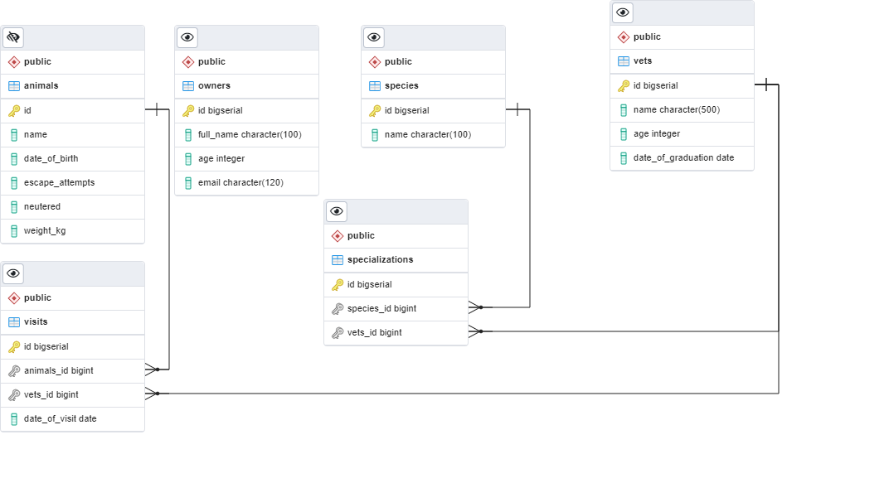

# Vet Clinic Database

> This is a vet clinic database design

## Getting Started

This repository includes files with plain SQL used to create a vet clinics database:

- Use [schema.sql](./schema.sql) to create all tables.
- Use [data.sql](./data.sql) to populate tables with data.
- Check [queries.sql](./queries.sql) for queries that can be run on a newly created database.

## Authors

👤 **Emmanuel Ogah**

- GitHub: [GitHub](https://github.com/Emmy-github-webdev).
- Twitter: [Twitter](https://twitter.com/OgaemmanuelOga).
- LinkedIn: [Linkedin](https://www.linkedin.com/in/emmanuel-oga-16171584/).

## 🤝 Contributing

Contributions, issues, and feature requests are welcome!

Feel free to check the [issues page](https://github.com/Emmy-github-webdev/postgrelsql-database-structure/issues).

## Show your support

Give a ⭐️ if you like this project!

## Acknowledgments

- Inspiration
- etc

## 📝 License

This project is [MIT](./MIT.md) licensed.
